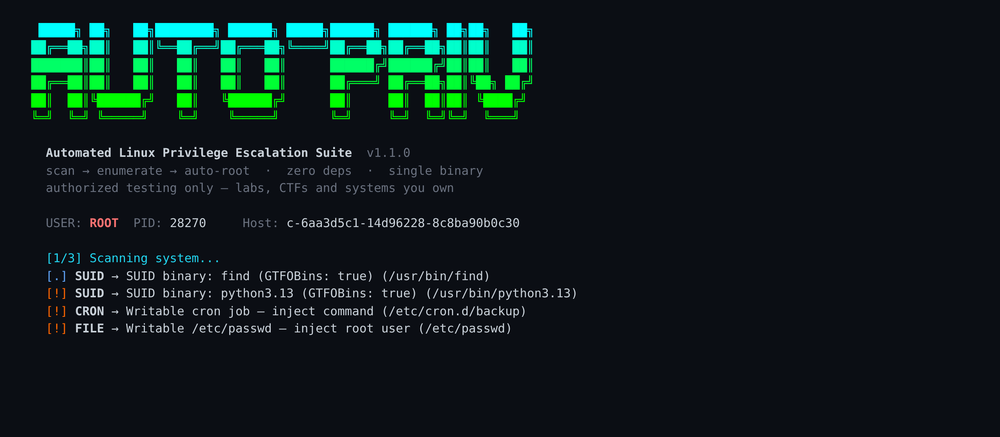
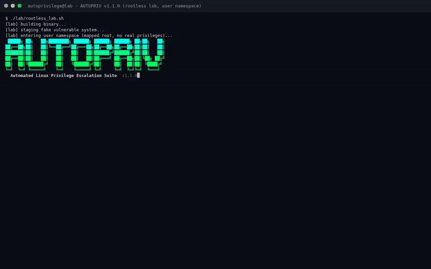
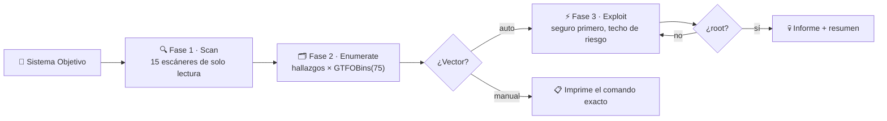

<div align="center">
  

  <p>
    <b>🇪🇸 Español</b> · <a href="./README.md">🇬🇧 English</a>
  </p>

  <p>
    
    
    
    
    
    
    
  </p>
</div>

# ⚠️ Aviso Ético

> **Esta herramienta está diseñada solo para tests de seguridad autorizados, CTFs y fines educativos.**
>
> - Úsala únicamente en sistemas que te pertenezcan o con permiso explícito por escrito
> - El uso indebido puede violar leyes locales e internacionales
> - El autor no se hace responsable de ningún daño causado por su mal uso

**Estás avisado.**

---

# 🚀 Visión General

**Auto-Privilege** es una suite automatizada de escalada de privilegios en Linux: escanea el sistema en busca de configuraciones inseguras, las mapea a técnicas de explotación y **las ejecuta de la más segura a la más agresiva** hasta conseguir root — todo en **un único binario de Go sin dependencias**.

<p align="center">
  
</p>

| Fase | Modo | Descripción |
|------|------|-------------|
| **1 · SCAN** | solo lectura | 15 escáneres pasivos: SUID, sudo, cron, capabilities, kernel, credenciales… |
| **2 · ENUMERATE** | solo lectura | Los hallazgos se cruzan con una base GTFOBins de 75 técnicas (embebida) |
| **3 · EXPLOIT** | mutante | Los vectores se ejecutan de más seguro a más agresivo con techo `--risk`; todo tiene marcha atrás |

Todo lo que la herramienta **no puede automatizar con seguridad** se imprime como **vector manual** con el comando exacto — nunca finge haber ejecutado algo que no ejecutó.

---

# 🎬 Demo

El GIF es una sesión real dentro del **lab rootless** (un namespace de usuario con un sistema vulnerable falso — sin Docker, sin root real):

<p align="center">
  
</p>

1. **Scan** del lab: SUID `python3`/`find`, cron escribible, `/etc/passwd` escribible, shadow legible, hijack de systemd, heurística de CVEs del kernel
2. **Dry-run**: el plan de ejecución exacto, de más seguro a más agresivo, con cada comando que ejecutaría
3. **Escalar**: la técnica GTFOBins de SUID abre una shell root dentro del lab (`id` → `uid=0`)

> Reprodúcelo tú mismo: `lab/rootless_lab.sh` — detalles en [Lab Rootless](#-lab-rootless-sin-docker-sin-root).

---

# ✨ Características

## 15 Escáneres (todos de solo lectura)

| # | Escáner | Detección | Riesgo |
|---|---------|-----------|--------|
| 1 | **Binarios SUID** | 9 directorios comunes + cruce con GTFOBins | Bajo→Alto |
| 2 | **Reglas sudo** | parseo de `sudo -n -l`, NOPASSWD + grupo sudo | Alto |
| 3 | **Cron escribible** | directorios cron + scripts referenciados | Alto |
| 4 | **/etc/passwd** | test real de escritura (no solo bits de modo) | Alto |
| 5 | **/etc/shadow** | test real de lectura/escritura | Alto/Peligro |
| 6 | **Docker** | membresía de grupo + socket escribible | Alto |
| 7 | **Caps de proceso** | decodificación del bitmask CapEff | Bajo→Medio |
| 8 | **File caps** | `getcap -r` buscando `cap_setuid+ep` | Medio |
| 9 | **Exports NFS** | `no_root_squash` en /etc/exports | Alto |
| 10 | **PATH escribible** | directorios del PATH escribibles por no-propietario | Alto |
| 11 | **Unidades systemd** | ficheros .service escribibles | Alto |
| 12 | **CVEs de kernel** | por rango de versiones: Dirty Pipe, OverlayFS, StackRot, nf_tables UAF | Medio/Alto |
| 13 | **PwnKit** | pkexec SUID (CVE-2021-4034, es polkit — no el kernel) | Alto |
| 14 | **Versión de sudo** | Baron Samedit (CVE-2021-3156, corregido en 1.9.5p2) | Alto |
| 15 | **Credenciales** | claves SSH, contraseñas en configs, secretos en history, metadata cloud | Bajo→Alto |

## Técnicas de Escalada

| Técnica | ¿Auto? | Riesgo |
|---------|:------:|--------|
| Shell SUID vía GTFOBins (`bash -p`, `python -c 'os.execl…'`) | ✅ | 🟢 Bajo / 🔴 Alto |
| sudo NOPASSWD vía técnica GTFOBins | ✅ | 🟠 Medio / 🔴 Alto |
| sudo ALL → `sudo -i` | ✅ | 🔴 Alto |
| Inyección en cron (reverse shell con tu `--lhost/--lport`) | ✅ | 🔴 Alto |
| Inyección root2 en `/etc/passwd` (hash sha512-crypt real) | ✅ | 🔴 Alto |
| Escape de Docker (`-v /:/mnt chroot`) | ✅ | 🔴 Alto |
| Intérprete `cap_setuid+ep` → `setuid(0)` | ✅ | 🟠 Medio |
| Shadow legible → hash para crackear offline | ✅ (lectura) | 🔴 Alto |
| NFS no_root_squash | 📋 manual | 🔴 Alto |
| Plantado de binario en PATH | 📋 manual | 🔴 Alto |
| Hijack de ExecStart de systemd | 📋 manual | 🔴 Alto |
| Exploits de CVEs de kernel | 📋 manual | 🟠/🔴 |
| Sobrescritura de shadow | 📋 manual | 💀 Peligro |

**🟢 SEGURO por defecto**: `--exploit` solo ejecuta vectores por debajo de `--risk=safe` hasta que subas el techo — la herramienta prefiere no hacer nada destructivo antes que estropear el sistema.

---

# 📦 Inicio Rápido

```bash
git clone https://github.com/Ruby570bocadito/Auto-Privilege.git
cd Auto-Privilege
go build -o autoprivilege .

# auditoría de solo lectura de esta máquina (seguro: no cambia nada)
./autoprivilege

# muestra el plan de ejecución sin ejecutar nada
./autoprivilege --exploit --dry-run --risk=medium

# auto-explotar, técnicas más seguras primero
./autoprivilege --exploit --risk=low
```

Requiere Go 1.26+ para compilar. El binario es estático y funciona en cualquier Linux.

---

# ⚡ Todos los Comandos

| Comando | Descripción |
|---------|-------------|
| `./autoprivilege` | escaneo + enumeración de solo lectura |
| `./autoprivilege --exploit` | auto-explotación (techo SAFE por defecto) |
| `./autoprivilege --exploit --risk=medium` | subir el techo de riesgo |
| `./autoprivilege --exploit --dry-run` | imprime el plan, no ejecuta nada |
| `./autoprivilege --vector=suid,sudo,cron` | centrarse en vectores concretos |
| `./autoprivilege --exploit --one-shot` | parar tras el primer éxito |
| `./autoprivilege --json` | informe legible por máquina en stdout |
| `./autoprivilege --report auditoria.md` | informe de evidencias en markdown |
| `./autoprivilege --list-gtfo` | volcar la base GTFOBins embebida |
| `./autoprivilege --update-gtfobins` | actualizar la DB desde upstream (persistida en `~/.autoprivilege/`) |
| `./autoprivilege --quiet` | solo código de salida: **0 = root, 1 = sin root** |
| `./autoprivilege --stealth` | pausas aleatorias entre escáneres/explotaciones |
| `./autoprivilege --lhost 10.0.0.1 --lport 4444` | listener de reverse shell para la inyección en cron |
| `./autoprivilege --no-color` | sin colores (auto al hacer pipe, respeta `NO_COLOR`) |
| `./autoprivilege --verbose` / `--log json` | diagnósticos en stderr |
| `./autoprivilege --version` / `--help` | metadatos / ayuda completa |

**Códigos de salida:** `0` root o escaneo simple · `1` explotación sin root · `2` error de uso.

---

# 🧪 Lab Rootless (sin Docker, sin root)

`lab/rootless_lab.sh` monta un **sistema vulnerable falso dentro de un namespace de usuario** (`unshare -r -m`):

- `/etc` es un bind-mount temporal: passwd/shadow escribibles, cron escribible, unidad systemd escribible
- `/usr/bin` es un bind-mount temporal con `python3` y `find` con bit SUID
- Los bits SUID solo dan el root *mapeado del namespace* — tu sistema jamás se toca

```bash
./lab/rootless_lab.sh                             # escanear el lab
./lab/rootless_lab.sh --exploit --dry-run --risk=danger
./lab/rootless_lab.sh --shell                     # shell dentro del lab
```

Dentro de la shell del lab, ejecuta la técnica GTFOBins tú mismo y mira cómo funciona:

```bash
/usr/bin/python3.13 -c 'import os; os.setuid(0); os.execl("/bin/sh","sh","-p")'
id    # uid=0(root) — dentro del namespace
```

Requiere `unshare` (util-linux) y namespaces de usuario activados. Sin Docker, sin sudo, sin root — perfecto para demos, clases y CI.

---

# 🐳 Testing con Docker

```bash
cd docker
docker compose build && docker compose up -d

docker exec autoprivilege-vulnerable /usr/local/bin/autoprivilege
docker exec autoprivilege-clean /usr/local/bin/autoprivilege
docker exec autoprivilege-edgecases /usr/local/bin/autoprivilege --vector=sudo

# suite completa (build, tests, validación JSON, anti-falsos-positivos, smoke tests)
./docker/test_runner.sh
```

Tres objetivos: **vulnerable** (10 fallos deliberados), **clean** (línea base — debe dar cero falsos positivos), **edgecases** (configuraciones tramposas).

---

# 🎯 Base de Datos GTFOBins

**75 técnicas embebidas en el binario** — cero llamadas de red en ejecución, funciona en sistemas aislados.

<details>
<summary><b>Binarios soportados</b></summary>

**Shell SUID (31):** bash, dash, fish, ksh, lua, lua5.3, lua5.4, node, nodejs, perl, perl5, php, php5, php7, php8, php8.1, php8.2, python, python2, python3, python3.8–3.13, ruby, ruby2, ruby3, sh, zsh

**sudo (44):** apache2, awk, cpan, docker, ed, env, ex, find, ftp, gawk, gdb, gem, git, journalctl, less, lxc, make, man, more, mysql, nawk, nice, nmap, npm, pip, pip3, psql, rsync, scp, sed, socat, sqlite3, ssh, stdbuf, systemctl, tar, tcpdump, timeout, unzip, vi, vim, wall, watch, zip

</details>

`--update-gtfobins` descarga el GTFOBins upstream, fusiona entradas nuevas y **las persiste** en `~/.autoprivilege/gtfobins.json` (se cargan solas en la siguiente ejecución).

---

# 📤 Formatos de Salida

**JSON** (`--json`) — stdout limpio, colores desactivados, seguro para pipes:

```json
{
  "tool": "Auto-Privilege",
  "version": "1.1.0",
  "host": "objetivo",
  "user": "operador",
  "timestamp": "2026-09-11T10:30:00Z",
  "duration_ms": 1420,
  "rooted": false,
  "findings": [ { "source": "SUID", "target": "/usr/bin/find", "risk": "LOW", "exploitable": true } ],
  "vectors":  [ { "name": "SUID find", "command": "find . -exec /bin/sh -p \\; -quit" } ]
}
```

**Markdown** (`--report auditoria.md`) — tabla de hallazgos + cada vector con su comando exacto, listo para adjuntar a un informe de auditoría.

---

# 🧠 Arquitectura



```
Auto-Privilege/
├── main.go                 entrada CLI + orquestación + códigos de salida
├── ui.go                   banner, ayuda, plan dry-run, resumen, lista GTFOBins
├── report.go               informe JSON + informe markdown de evidencias
├── scanner.go              15 escáneres de solo lectura (+ heurísticas honestas)
├── enumerate.go            hallazgos → vectores (auto + manual)
├── exploit.go              motor de ejecución (seguro primero, interactivo/capturado)
├── gtfobins.go             base GTFOBins embebida (75 entradas)
├── gtfobins_update.go      actualización upstream con persistencia real
├── logger.go               diagnósticos en stderr (text/json)
├── universe.go             tipos, niveles de riesgo, colores TTY-aware
├── autoprivilege_test.go   20+ tests unitarios (decodificación del banner, parseo…)
├── lab/rootless_lab.sh     lab de demo rootless (namespace de usuario)
├── docker/                 objetivos vulnerable / clean / edgecases + runner
└── docs/images/            banner + GIF demo (sesiones reales)
```

---

# 📊 Niveles de Riesgo

| Nivel | Ejemplos | ¿Auto-explota? | ¿Toca el FS? |
|-------|----------|:---:|:---:|
| 🟢 **SAFE** | SUID GTFOBins → shell | ✅ por defecto | No |
| 🔵 **LOW** | `find -exec` SUID | ✅ con `--risk=low` | No |
| 🟠 **MEDIUM** | cap_setuid, heurísticas de kernel | ✅ con `--risk=medium` | No |
| 🔴 **HIGH** | inyección cron, escritura passwd, docker | ✅ con `--risk=high` | Sí |
| 💀 **DANGER** | sobrescribir shadow | 📋 solo manual | Sí, arriesgado |

---

<div align="center">
  
  <br/><br/>
  <sub>Hecho con ❤️ por <a href="https://github.com/Ruby570bocadito">Ruby570bocadito</a> · © 2026 · Licencia MIT</sub>
</div>
