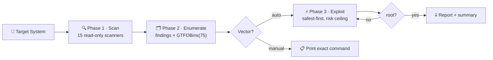

<div align="center">
  

  <p>
    <a href="./README.es.md">🇪🇸 Español</a> · <b>🇬🇧 English</b>
  </p>

  <p>
    
    
    
    
    
    
    
  </p>
</div>

# ⚠️ Ethical Warning

> **This tool is designed for authorized security testing, CTF competitions, and educational purposes only.**
>
> - Only use it on systems you own or have explicit written permission to test
> - Misuse may violate local and international laws
> - The author is not responsible for any damage caused by misuse

**You have been warned.**

---

# 🚀 Overview

**Auto-Privilege** is an automated Linux privilege escalation suite: it scans a system for misconfigurations, maps them to exploit techniques and **executes them safest-first** until it gets root — in a **single Go binary with zero dependencies**.

<p align="center">
  
</p>

| Phase | Mode | Description |
|-------|------|-------------|
| **1 · SCAN** | read-only | 15 passive scanners probe SUID, sudo, cron, capabilities, kernel, credentials… |
| **2 · ENUMERATE** | read-only | Findings are mapped against a 75-entry GTFOBins database (embedded) |
| **3 · EXPLOIT** | mutating | Vectors execute safest-first under a `--risk` ceiling; every vector has an off-switch |

Everything the tool *cannot* safely automate is printed as a **manual vector** with the exact command — it never pretends to have executed something it did not.

---

# 🎬 Demo

The GIF below is a real session inside the **rootless lab** (a user namespace with a fake vulnerable system — no containers, no real root):

<p align="center">
  
</p>

1. **Scan** the lab: SUID `python3`/`find`, writable cron, writable `/etc/passwd`, readable shadow, systemd hijack, kernel CVE heuristic
2. **Dry-run**: the exact execution plan, safest first, with every command it would run
3. **Escalate**: the SUID GTFOBins technique opens a root shell inside the lab (`id` → `uid=0`)

> Reproduce it yourself: `lab/rootless_lab.sh` — details in [Rootless Lab](#-rootless-lab-no-docker-no-root).

---

# ✨ Features

## 15 Scanners (all read-only)

| # | Scanner | Detection | Risk |
|---|---------|-----------|------|
| 1 | **SUID binaries** | 9 common dirs, GTFOBins cross-check | Low→High |
| 2 | **sudo rules** | `sudo -n -l` parsing, NOPASSWD + sudo group | High |
| 3 | **Writable cron** | cron dirs + crontab-referenced scripts | High |
| 4 | **/etc/passwd** | real write access test (not just mode bits) | High |
| 5 | **/etc/shadow** | real read/write access test | High/Danger |
| 6 | **Docker** | group membership + socket writability | High |
| 7 | **Process caps** | CapEff bitmask decode (setuid/sys_admin/sys_ptrace) | Low→Medium |
| 8 | **File caps** | `getcap -r` for `cap_setuid+ep` interpreters | Medium |
| 9 | **NFS exports** | `no_root_squash` in /etc/exports | High |
| 10 | **Writable PATH** | PATH dirs writable by non-owner | High |
| 11 | **systemd units** | writable service files | High |
| 12 | **Kernel CVEs** | version-range match: Dirty Pipe, OverlayFS, StackRot, nf_tables UAF | Medium/High |
| 13 | **PwnKit** | SUID pkexec (CVE-2021-4034, polkit — not the kernel) | High |
| 14 | **sudo version** | Baron Samedit (CVE-2021-3156, fixed 1.9.5p2) | High |
| 15 | **Credentials** | SSH keys, config passwords, history secrets, cloud metadata | Low→High |

## Exploitation Techniques

| Technique | Auto? | Risk |
|-----------|:-----:|------|
| SUID GTFOBins shell (`bash -p`, `python -c 'os.execl…'`) | ✅ | 🟢 Low / 🔴 High |
| sudo NOPASSWD via GTFOBins technique | ✅ | 🟠 Medium / 🔴 High |
| sudo ALL → `sudo -i` | ✅ | 🔴 High |
| Cron injection (reverse shell with your `--lhost/--lport`) | ✅ | 🔴 High |
| `/etc/passwd` root2 injection (real sha512-crypt hash) | ✅ | 🔴 High |
| Docker breakout (`-v /:/mnt chroot`) | ✅ | 🔴 High |
| `cap_setuid+ep` interpreter → `setuid(0)` | ✅ | 🟠 Medium |
| Shadow read → hash for offline cracking | ✅ (read) | 🔴 High |
| NFS no_root_squash | 📋 manual | 🔴 High |
| PATH binary planting | 📋 manual | 🔴 High |
| systemd ExecStart hijack | 📋 manual | 🔴 High |
| Kernel CVE exploits | 📋 manual | 🟠/🔴 |
| Shadow overwrite | 📋 manual | 💀 Danger |

**🟢 SAFE by default**: `--exploit` only runs vectors at or below `--risk=safe` until you raise the ceiling — the tool errs on the side of doing nothing destructive.

---

# 📦 Quick Start

```bash
git clone https://github.com/Ruby570bocadito/Auto-Privilege.git
cd Auto-Privilege
go build -o autoprivilege .

# read-only audit of this machine (safe: changes nothing)
./autoprivilege

# show the execution plan without running anything
./autoprivilege --exploit --dry-run --risk=medium

# auto-exploit, safest techniques first
./autoprivilege --exploit --risk=low
```

Requires Go 1.26+ to build. The binary is static and runs anywhere on Linux.

---

# ⚡ All Commands

| Command | Description |
|---------|-------------|
| `./autoprivilege` | read-only scan + enumerate |
| `./autoprivilege --exploit` | auto-exploit (SAFE ceiling by default) |
| `./autoprivilege --exploit --risk=medium` | raise the risk ceiling |
| `./autoprivilege --exploit --dry-run` | print the plan, execute nothing |
| `./autoprivilege --vector=suid,sudo,cron` | focus specific vectors |
| `./autoprivilege --exploit --one-shot` | stop after first success |
| `./autoprivilege --json` | machine-readable report on stdout |
| `./autoprivilege --report audit.md` | markdown evidence report |
| `./autoprivilege --list-gtfo` | dump the embedded GTFOBins database |
| `./autoprivilege --update-gtfobins` | refresh the DB from upstream (persisted to `~/.autoprivilege/`) |
| `./autoprivilege --quiet` | exit code only: **0 = root, 1 = no root** |
| `./autoprivilege --stealth` | jitter between scanners/exploits |
| `./autoprivilege --lhost 10.0.0.1 --lport 4444` | reverse-shell listener for cron injection |
| `./autoprivilege --no-color` | disable colors (auto-off when piped, honors `NO_COLOR`) |
| `./autoprivilege --verbose` / `--log json` | stderr diagnostics |
| `./autoprivilege --version` / `--help` | metadata / full help |

**Exit codes:** `0` root or scan-only · `1` exploit ran without root · `2` usage error.

---

# 🧪 Rootless Lab (no Docker, no root)

`lab/rootless_lab.sh` builds a **fake vulnerable system inside a user namespace** (`unshare -r -m`):

- `/etc` is bind-mounted from a temp dir: writable passwd/shadow, writable cron job, writable systemd unit
- `/usr/bin` is bind-mounted from a temp copy with SUID `python3` and `find`
- The SUID bits only grant the *namespace's* mapped root — your system is never touched

```bash
./lab/rootless_lab.sh                             # scan the lab
./lab/rootless_lab.sh --exploit --dry-run --risk=danger
./lab/rootless_lab.sh --shell                     # shell inside the lab
```

Inside the lab shell, run the GTFOBins technique yourself and watch it land:

```bash
/usr/bin/python3.13 -c 'import os; os.setuid(0); os.execl("/bin/sh","sh","-p")'
id    # uid=0(root) — inside the namespace
```

Requires `unshare` (util-linux) and user namespaces enabled. No docker, no sudo, no root — perfect for demos, classes and CI.

---

# 🐳 Docker Testing

```bash
cd docker
docker compose build && docker compose up -d

docker exec autoprivilege-vulnerable /usr/local/bin/autoprivilege
docker exec autoprivilege-clean /usr/local/bin/autoprivilege
docker exec autoprivilege-edgecases /usr/local/bin/autoprivilege --vector=sudo

# full suite (build, tests, json validation, false-positive checks, flag smoke tests)
./docker/test_runner.sh
```

Three targets: **vulnerable** (10 deliberate flaws), **clean** (baseline — must produce zero false positives), **edgecases** (tricky configurations).

---

# 🎯 GTFOBins Database

**75 techniques embedded in the binary** — zero network calls at runtime, works air-gapped.

<details>
<summary><b>Supported binaries</b></summary>

**SUID shell (31):** bash, dash, fish, ksh, lua, lua5.3, lua5.4, node, nodejs, perl, perl5, php, php5, php7, php8, php8.1, php8.2, python, python2, python3, python3.8–3.13, ruby, ruby2, ruby3, sh, zsh

**sudo (44):** apache2, awk, cpan, docker, ed, env, ex, find, ftp, gawk, gdb, gem, git, journalctl, less, lxc, make, man, more, mysql, nawk, nice, nmap, npm, pip, pip3, psql, rsync, scp, sed, socat, sqlite3, ssh, stdbuf, systemctl, tar, tcpdump, timeout, unzip, vi, vim, wall, watch, zip

</details>

`--update-gtfobins` fetches upstream GTFOBins, merges new entries and **persists them** to `~/.autoprivilege/gtfobins.json` (loaded automatically on the next run).

---

# 📤 Output Formats

**JSON** (`--json`) — clean stdout, colors auto-disabled, safe to pipe:

```json
{
  "tool": "Auto-Privilege",
  "version": "1.1.0",
  "host": "target",
  "user": "operator",
  "timestamp": "2026-09-11T10:30:00Z",
  "duration_ms": 1420,
  "rooted": false,
  "findings": [ { "source": "SUID", "target": "/usr/bin/find", "risk": "LOW", "exploitable": true } ],
  "vectors":  [ { "name": "SUID find", "command": "find . -exec /bin/sh -p \\; -quit" } ]
}
```

**Markdown** (`--report audit.md`) — findings table + every vector with its exact command, ready to attach to an engagement report.

---

# 🧠 Architecture


```mermaid
flowchart LR
    A["🎯 Target System"] --> B["🔍 Phase 1 · Scan<br/>15 read-only scanners"]
    B --> C["🗂️ Phase 2 · Enumerate<br/>findings × GTFOBins(75)"]
    C --> D{"Vector?"}
    D -->|auto| E["⚡ Phase 3 · Exploit<br/>safest-first, risk ceiling"]
    D -->|manual| F["📋 Print exact command"]
    E --> G{"root?"}
    G -->|yes| H["💀 Report + summary"]
    G -->|no| E
```

```
Auto-Privilege/
├── main.go                 CLI entry + orchestration + exit codes
├── ui.go                   banner, help, dry-run plan, summary, GTFOBins list
├── report.go               JSON report + markdown evidence report
├── scanner.go              15 read-only scanners (+ honest CVE heuristics)
├── enumerate.go            findings → exploit vectors (auto + manual)
├── exploit.go              execution engine (safest-first, interactive/captured)
├── gtfobins.go             embedded GTFOBins database (75 entries)
├── gtfobins_update.go      upstream refresh with real persistence
├── logger.go               stderr diagnostics (text/json)
├── universe.go             types, risk levels, TTY-aware colors
├── autoprivilege_test.go   20+ unit tests (banner decode, parsing, ranges…)
├── lab/rootless_lab.sh     rootless demo lab (user namespace)
├── docker/                 vulnerable / clean / edgecases targets + runner
└── docs/images/            banner + demo GIF (real sessions)
```

---

# 📊 Risk Levels

| Level | Examples | Auto-exploit | FS changes |
|-------|----------|:---:|:---:|
| 🟢 **SAFE** | GTFOBins SUID → shell | ✅ default | No |
| 🔵 **LOW** | `find -exec` SUID | ✅ with `--risk=low` | No |
| 🟠 **MEDIUM** | cap_setuid, kernel heuristics | ✅ with `--risk=medium` | No |
| 🔴 **HIGH** | cron injection, passwd write, docker | ✅ with `--risk=high` | Yes |
| 💀 **DANGER** | shadow overwrite | 📋 manual only | Yes, risky |

---

<div align="center">
  
  <br/><br/>
  <sub>Built with ❤️ by <a href="https://github.com/Ruby570bocadito">Ruby570bocadito</a> · © 2026 · MIT License</sub>
</div>
