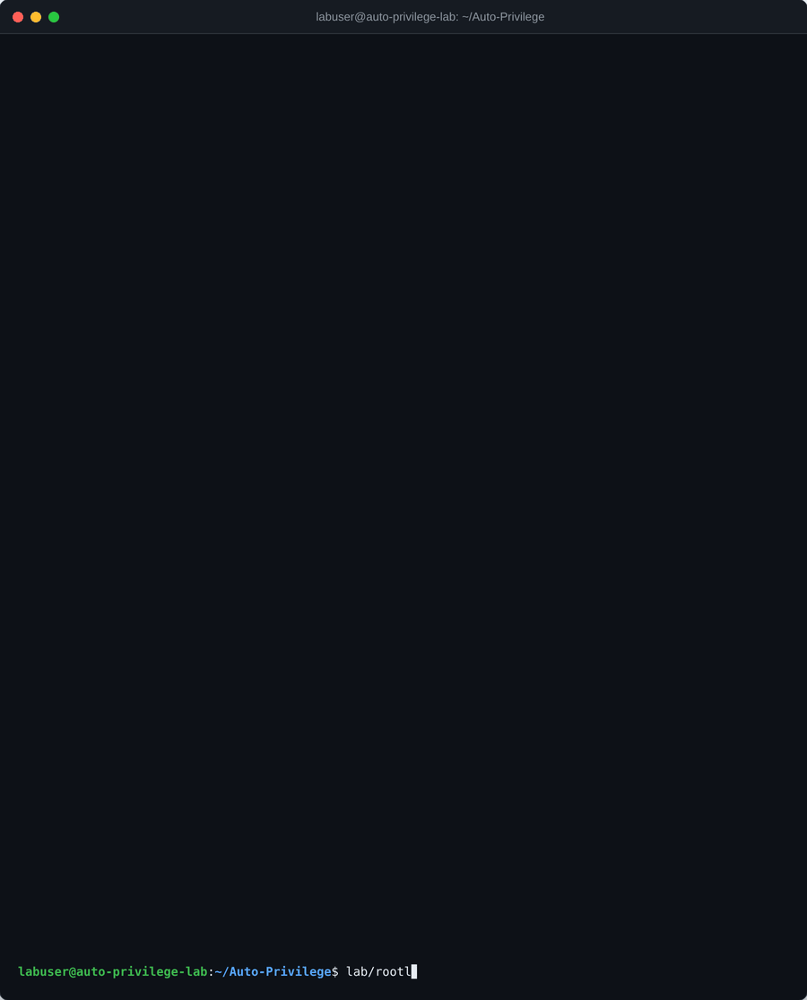
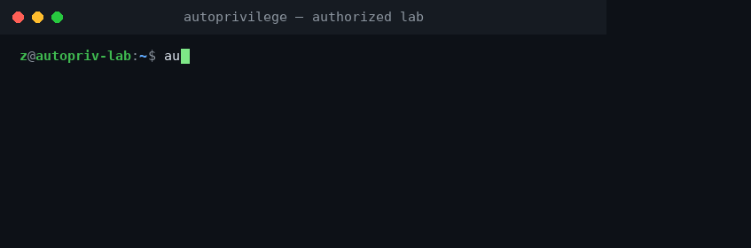
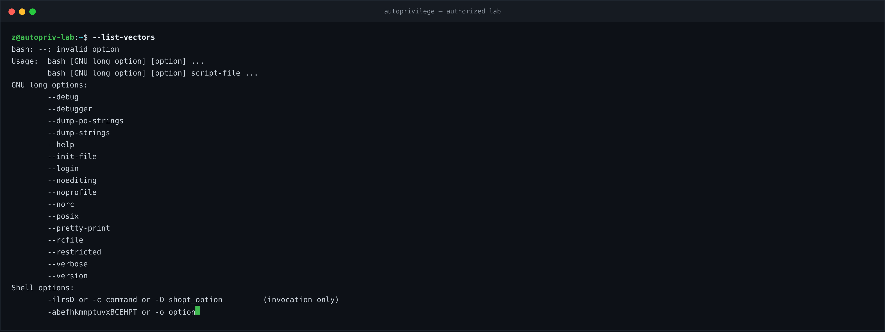
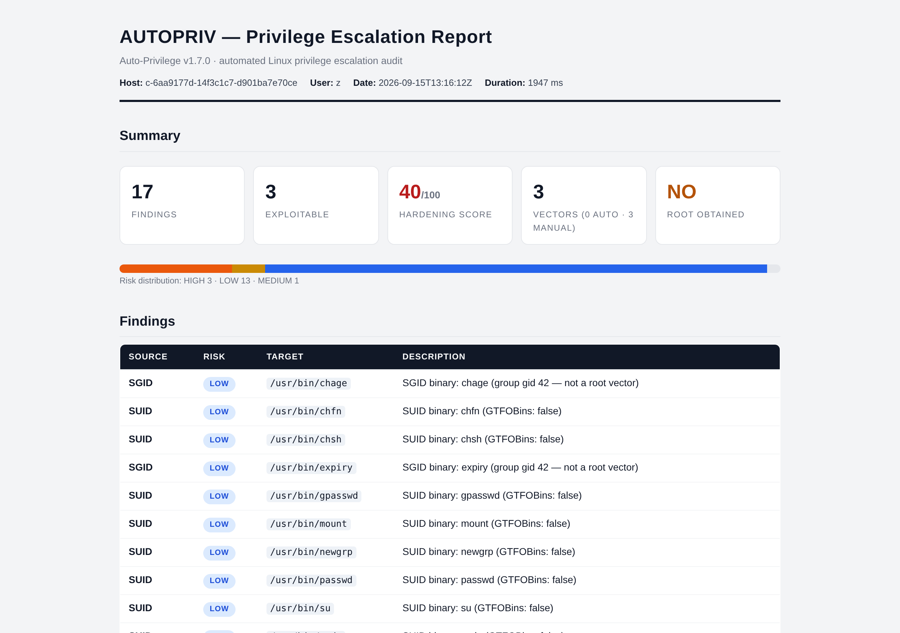
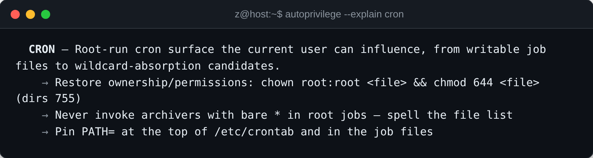

<p align="center"></p>

<h1 align="center">AUTOPRIV</h1>

<p align="center"><b>Automated Linux privilege escalation suite — scan, enumerate, auto-root.</b><br>
One Go binary. Zero dependencies. Honest results.</p>

<p align="center">
  <a href="https://github.com/Ruby570bocadito/Auto-Privilege/actions/workflows/ci.yml"></a>
  
  
  
</p>

<p align="center"></p>
<p align="center"></p>
<p align="center"><i>Real terminal output — no mockups. More media below: the <a href="#output-formats">HTML report</a>, the hardening playbook and the vector catalog.</i></p>

---

## What is AUTOPRIV?

AUTOPRIV is a post-exploitation tool for **authorized** Linux security work: labs, CTFs and systems you own. You drop the single static binary on a box, it audits the machine read-only in seconds, and it tells you — with evidence — every local privilege-escalation path it found. If you ask it to, it walks those paths for you, always from the safest technique to the most destructive one, and it stops the moment it reaches `uid=0`.

It is built for two very different moments. In an engagement, it is the fastest way to answer "can this box go root, and how?". In a study session, it is a teacher: every finding explains the vector, the risk and the exact command an operator would run, so you can reproduce it manually and actually learn the technique.

Everything is deliberate about its honesty. Vectors it cannot verify automatically are marked `manual` instead of pretending. Kernel CVE matches say *verify before use (heuristic)*. When it reaches root it prints `uid=0` evidence from the shell itself, and when it does not, it says so and exits with code 1.

## Highlights

| | |
|---|---|
| **20 read-only scanners** | SUID/SGID, sudo rules + version, writable cron (+ wildcard-injection candidates), passwd/shadow injection, docker group, container runtime context (podman/containerd/docker daemon), capabilities (both bitmask and file caps), NFS (no_root_squash + hostless-rw exports), writable PATH dirs, systemd units AND init.d scripts, kernel CVEs, credentials in history/configs, cloud metadata, `ld.so.preload` + writable `ld.so.conf(.d)`, writable sudoers (file, dir and per-file drop-ins), writable `/etc/group`, writable login hooks (`/etc/environment`, `/etc/profile.d`, `/etc/profile`, `/etc/bash.bashrc`) |
| **75 GTFOBins techniques + 31 sgid** | embedded in the binary — works air-gapped; refreshable from upstream with one command (`--list-gtfo` shows the sgid section) |
| **Hardening score** | every scan ends with a deterministic 0–100 posture number — weighted by risk and exploitability — so `--baseline` diffs read `score 60 → 85` instead of raw counts |
| **Hardening playbook** | `--explain cron` (or `all`) prints the exact remediation steps per finding source; `--report` embeds a `## Hardening plan` section built from the sources actually detected |
| **Safest-first auto-exploit** | techniques sorted by risk, `--risk` cap, `--one-shot` stop at first root |
| **Five output formats** | human terminal with truecolor ramp, `--json` for machines (`--output file` persists it, 0600), markdown `--report` with evidence, self-contained `--html` page for stakeholders, and `--sarif` for GitHub/GitLab code-scanning dashboards |
| **Two CI gates → three** | `--fail-on risk` fails when the surface EXISTS at/above a risk; `--fail-on-new` (optional threshold: `--fail-on-new=high`) fails only when it GROWS — the regression verdict for progressive-hardening pipelines; `--min-score n` fails while the posture number sits under the floor |
| **Rootless demo lab** | `lab/rootless_lab.sh` builds a fake-vulnerable box inside a user namespace — no Docker, no real root, nothing touches your system |
| **Script-friendly** | `--quiet` + exit codes (`0` root, `1` no root, `2` error, `3` policy gate), `--no-color` auto when piped, `NO_COLOR` respected, `--parallel` cuts scan wall-clock with byte-identical results |

## How it works

**1 — Scan.** Every scanner runs read-only and emits findings with risk labels: `[.]` informational, `[+]` exploitable, `[!]` notable. The scan phase never modifies the machine — it reads sudoers, cron, passwd/shadow, mounts, capabilities, kernel version, shell history and config files.

**2 — Enumerate.** Findings become vectors. Each vector gets a concrete technique and the exact command that would be run, pulled from the embedded GTFOBins database where applicable (SUID `python3`, `find`, `vim`, ...). Vectors that need a human decision are flagged `manual`.

**3 — Exploit (opt-in).** With `--exploit`, vectors are sorted safest-first and executed under the risk cap. The session ends the moment `uid=0` is confirmed — or after the list is exhausted, with an honest `no root` and exit code 1.

## Quick start

**Download a release binary** (linux amd64 / arm64, statically linked):

```bash
curl -LO https://github.com/Ruby570bocadito/Auto-Privilege/releases/latest/download/autoprivilege-linux-amd64
chmod +x autoprivilege-linux-amd64 && mv autoprivilege-linux-amd64 autoprivilege
./autoprivilege --help
```

**Or build from source** (Go 1.26+, no module dependencies to fetch):

```bash
git clone https://github.com/Ruby570bocadito/Auto-Privilege.git
cd Auto-Privilege
go build -o autoprivilege .
./autoprivilege
```

**Or just try it in the safe lab first:**

```bash
lab/rootless_lab.sh                  # read-only scan of a fake vulnerable box
lab/rootless_lab.sh --exploit        # watch it climb to uid=0 in a namespace
```

## Usage

```
autoprivilege [options]

Modes:
  (default)                 scan + enumerate (read-only, no changes)
  --exploit                 auto-exploit found vectors, safest first
  --dry-run                 scan + enumerate, show what would run
  --list-gtfo               print the embedded GTFOBins database
  --list-vectors            print the supported vector catalog
  --completion shell        print a shell completion script: bash, zsh or fish
  --explain src             hardening playbook for a finding source (or all)
  --update-gtfobins         refresh GTFOBins db from upstream (persisted)

Targeting:
  --vector list             comma-separated: suid,sgid,sudo,cron,passwd,shadow,
                            docker,container,caps,nfs,path,service,kernel,cred,
                            preload,sudoers,group,hooks,all
  --risk level              max auto-exploit risk: safe|low|medium|high|danger
  --one-shot                stop after the first successful exploit
  --lhost ip                reverse-shell listener host (auto-detected)
  --lport port              reverse-shell listener port (default 4444)

Output:
  --json                    machine-readable report on stdout
  --output file             write the JSON report to a file (0600)
  --report file             also write a markdown evidence report
  --html file               write a self-contained HTML report (0600)
  --sarif file              SARIF 2.1.0 report for code-scanning dashboards
  --sarif-stdout            print the SARIF log to stdout (not with --json)
  --baseline file           diff findings against a previous --json/--output report
  --quiet                   no output; exit code 0 = root, 1 = no root
  --no-color                disable ANSI colors (auto-off when piped)
  --verbose                 debug logging on stderr
  --log fmt                 log format: text|json (stderr)

Misc:
  --ignore list             exclude finding sources entirely: e.g. CRED,CONTAINER
  --parallel                run scanners concurrently (same results, faster)
  --stealth                 jitter between scanners and exploits
  --scan-timeout dur        timeout for scan-time external commands (default 5s)
  --fail-on risk            exit 3 when exploitable findings >= risk
                            (low|medium|high|danger) — CI hardening gate
  --fail-on-new [risk]      exit 3 when NEW exploitable findings appear vs
                            --baseline — regression gate (requires it);
                            optional threshold: --fail-on-new=low|medium|high|danger
  --min-score n             exit 3 when the hardening score lands below the
                            floor (1-100) — posture gate; 0 disables it
  --rooteame path           load .ko module if root is obtained (lab only)
  --version                 print version
  -h, --help                this help
```

Exit codes: `0` root obtained · `1` no root · `2` usage or runtime error · `3` a CI gate tripped — `--fail-on` policy, `--fail-on-new` regression or `--min-score` posture (gates win over `1`; all reports are written either way).

Not sure what `--vector` accepts? `--list-vectors` prints the catalog — every vector name with a one-line description of what it actually inspects, read from the same table the binary itself uses, so the docs can never drift from the code:

<p align="center"></p>

## Vectors covered

| Vector | What it checks | Auto? |
|---|---|---|
| `suid` | SUID binaries (recursive walk) + GTFOBins match (`python3`, `find`, ...) | yes |
| `sgid` | SGID binaries with root group — group-level escalation, manual vector (GTFOBins `sgid` technique preferred; SUID fallback declared in the note) | manual |
| `sudo` | sudo -l rules, NOPASSWD entries, sudo version CVEs (Baron Samedit range) | partial |
| `cron` | writable `/etc/cron*`, PATH cron jobs, wildcard-injection candidates in root schedules (`tar`/`rsync`/`zip`/`7z` with `*` arguments) | yes |
| `passwd` | writable `/etc/passwd` — root user injection | yes |
| `shadow` | readable `/etc/shadow` — hash extraction | yes |
| `docker` | docker group / socket access → host root | partial |
| `container` | inside-container indicator with privilege/PID-namespace evidence, podman/containerd sockets, reachable docker daemon | partial |
| `caps` | cap_setuid processes, file capabilities (`getcap -r /`) | yes |
| `nfs` | `no_root_squash` exports (exploitable) and `rw` exports with no host restriction (informational) | manual |
| `path` | writable dirs in root's PATH | yes |
| `service` | writable systemd units AND SysV init.d scripts (both execute as root at boot/restart) | yes |
| `kernel` | kernel-range CVEs: Dirty Pipe, Dirty Cow, OverlayFS, StackRot, nf_tables; PwnKit via pkexec | partial |
| `cred` | passwords in history, configs, cloud metadata (imds, 800 ms timeout) | yes |
| `preload` | `/etc/ld.so.preload` non-empty (loaded with euid 0 into every SUID binary) and writable `ld.so.conf`/`ld.so.conf.d` (library search paths absorbed by the next ldconfig) — HIGH/exploitable when writable, informational otherwise | manual |
| `sudoers` | writable `/etc/sudoers` (append NOPASSWD rule, auto) or writable `/etc/sudoers.d` (drop-in, manual: sudo requires root-owned files); per-file pass surfaces root-owned writable drop-ins behind a locked dir | partial |
| `group` | writable `/etc/group` — append yourself to sudo/wheel/docker, effective next login | manual |
| `hooks` | writable login-time hooks: `/etc/environment` (LD_PRELOAD into every session), `/etc/profile.d`, `/etc/profile`, `/etc/bash.bashrc` | manual |

`partial` means AUTOPRIV sets the stage (version checks, rule parsing) but a human confirms the final step — the tool says so instead of faking it.

The `docker`/`container` probes inherit your shell environment, so a daemon configured via `DOCKER_HOST` (remote or local) counts as reachable — the finding says "verify rootful vs rootless" because a rootless daemon contains the classic breakout.

## Output formats

**Terminal** — colorized findings with per-line evidence and a final summary (real output of the rootless lab; inside the user namespace the tool starts as mapped root, hence `rooted YES`):

```
  ── Findings ──
  [.] SUID → SUID binary: find (GTFOBins: true) (/usr/bin/find)
  [!] SUID → SUID binary: python3.13 (GTFOBins: true) (/usr/bin/python3.13)
  [!] CRON → Writable cron job — inject command (/etc/cron.d/backup)
  [!] FILE → Writable /etc/passwd — inject root user (/etc/passwd)
  [!] FILE → Readable /etc/shadow — crack root hash (/etc/shadow)
  [*] FILE → Writable /etc/shadow — set root password (/etc/shadow)
  [~] CAPS → Process holds CAP_SETUID — can become root in-process (cap_setuid)
  [!] SERVICE → Writable systemd service — hijack execution (/etc/systemd/system/vuln.service)

  ── Summary ─────────────────────────────
   findings   12  (exploitable 9)
   score      31/100
   vectors    9  (auto 6 · manual 3)
   risks      LOW 3  MEDIUM 1  HIGH 7  DANGER 1
   rooted     YES
   time       1.7s
```

**JSON** (`--json`) — one object on stdout, ready for `jq` (lab progress goes to stderr, so the pipe is clean):

```bash
$ lab/rootless_lab.sh --json --quiet | jq '.summary'
{
  "findings": 12,
  "exploitable": 9,
  "score": 31,
  "vectors": 9,
  "auto": 6,
  "manual": 3,
  "risks": { "DANGER": 1, "HIGH": 7, "LOW": 3, "MEDIUM": 1 },
  "rooted": true
}
```

**Markdown** (`--report audit.md`) — a summary table with the at-a-glance counts (findings, exploitable, hardening score, auto/manual vectors, risk distribution), per-vector sections with the command, the risk and the evidence lines, and a `## Hardening plan` section: the exact remediation playbook for every source the scan actually detected. Suitable as an engagement appendix that carries its own checklist.

**HTML** (`--html audit.html`) — the shareable page: one self-contained document (inline CSS, zero external resources, no JavaScript) that opens from `file://` on any laptop, air-gapped included. Summary cards, the risk-distribution bar, the findings table with color-coded badges, the hardening plan as collapsible per-source playbooks and every vector command in a copy-ready block — all rendered from the same buildReport the JSON export produces, so the page can never disagree with the machine output. Every dynamic value is HTML-escaped (a credential file containing `<script>` renders as text, tested) and the file lands 0600 through the same atomic write as the other reports. Attach it to the engagement doc and send it:

<p align="center"></p>

**SARIF** (`--sarif audit.sarif`) — the findings dressed as a SARIF 2.1.0 log, the format GitHub's code-scanning tab, GitLab and every SARIF viewer ingest natively: one rule per finding source, `error`/`warning`/`note` levels mapped from the risk scale, `file://` locations for path targets (non-path targets like `ALL` or CVE ids embed the target into the message instead). Written 0600 like every other report artifact. Upload it with `github/codeql-action/upload-sarif@v3` and the scan shows up in the Security tab — no converter, no external dependency.

**Baseline diff** (`--baseline prev.json`) — the hardening loop, closed: snapshot a machine with `--output base.json`, fix what you can, re-scan against the snapshot and the tool classifies every finding as **new** (surface grew) or **resolved** (fix worked), keyed by source+target so reordering or rewording never fakes a change. The diff carries the hardening-score trajectory (`score 60 → 85`; baselines written before the metric existed render `baseline predates scoring` instead of faking a regression) and appears in the terminal, in the JSON (`"diff"` key with `new`/`resolved`/`new_exploitable`/`score_after`/`summary_before`) and in a `## Diff vs baseline` section of the markdown report:

```bash
$ autoprivilege --output base.json          # day 0: snapshot
$ # ... harden the machine ...
$ autoprivilege --baseline base.json        # day N: verify
  ── Diff vs baseline ─────────────────────
   new        1  (exploitable 1)
   resolved   3
   score      60 → 85
```

**CI hardening gate** (`--fail-on`) — turn the scan into a policy check: `--quiet --fail-on high` exits `3` when at least one exploitable finding sits at or above the threshold, so a pipeline (or a cron job shipping reports) fails loudly the moment the measured surface regresses. **Regression gate** (`--fail-on-new [risk]`, requires `--baseline`) — the sharper CI verdict: exit `3` only when a NEW exploitable finding appears versus the snapshot, so hardening progress never fails the pipeline and a regression always does. The optional threshold narrows the verdict: bare `--fail-on-new` trips on any new exploitable finding, `--fail-on-new=high` only when the regression is HIGH or worse — noisy low-risk drift stays green while a real escalation path fails the build (invalid thresholds fail fast at parse time, exit 2). **Posture gate** (`--min-score n`) — the third verdict, scored instead of counted: exit `3` while the hardening score sits under the floor (`--quiet --min-score 70` fails until the host scores 70+), the perfect companion to the `--baseline` score trajectory — harden the box, watch `score 40 → 85`, and the gate goes green on its own. All three gates share the exit-3 contract and compose; the policy and regression verdicts (which name their finding) take message precedence over the score verdict. Compose the set: `--parallel` for speed, `--sarif` for the dashboard, `--fail-on-new=high` for the regression verdict, `--min-score 70` for the posture floor, `--report`/`--html` with the hardening plan for the fix list.

**Shell completion** (`--completion bash|zsh|fish`) — tab-completion for every flag, generated from the same flag table the binary registers at startup: a new flag lands in the next completion automatically, and the script can never offer a flag the binary rejects. `autoprivilege --completion bash >> ~/.bashrc` and every flag documents itself as you type.

**Hardening playbook** (`--explain cron`, `--explain all`) — the remediation half of the loop: for every finding source, what it means and the exact steps that close it, safest first. The same playbook ships inside every `--report`/`--html` as a per-source section built from the sources the scan actually detected:

<p align="center"></p>

## The rootless lab

<p align="center"></p>

The lab is a fake compromised box built inside a **user namespace** (`unshare -r -m`): a temporary `/etc` with writable passwd/shadow/cron, a bind-mounted `/usr/bin` seeded with SUID `python3` and `find`. The SUID bits only grant the namespace's mapped root — never yours. It is the safest way to demo, test and screenshot the full scan → enumerate → root cycle without Docker or any privileged setup:

```bash
lab/rootless_lab.sh                             # scan only
lab/rootless_lab.sh --exploit --dry-run         # show the plan
lab/rootless_lab.sh --exploit --risk=danger     # full climb to uid=0
lab/rootless_lab.sh --shell                     # interactive namespace shell
lab/rootless_lab.sh --seeds                     # list the staged vulnerabilities
```

What the lab stages (see `--seeds`): SUID `python3` + `find` in `/usr/bin`, a writable root cron job in `/etc/cron.d/backup`, writable `/etc/passwd`, an owned (readable + writable) `/etc/shadow`, a writable `vuln.service` systemd unit, and a world-writable PATH directory as binary-planting bait. Everything is FAKE and lives only inside the namespace.

## Docker testing

Four containers cover the matrix: `vulnerable` (should find vectors), `clean` (should find none), `edgecases` (weird perms, symlinks), and `autoprivilege-test` (runs the whole suite):

```bash
cd docker && docker compose up --build
./docker/test_runner.sh
```

## Safety and ethics

AUTOPRIV is for **authorized security work only**: your own machines, labs, CTFs and engagements with written permission. It changes nothing by default; exploitation only happens behind `--exploit`, and even then it prefers reversible techniques and stops at the risk you allowed. Do not run it on systems you do not own or are not explicitly authorized to test.

## Testing and CI

140 unit tests cover the tricky parts on purpose: banner art is decode-verified rune by rune (no more misspelled ASCII art), vector CSV parsing, risk sorting, kernel CVE ranges, sudo version ranges, exploit timeouts, shell-quoting regressions, spool guards, hash formats and markdown escaping, plus the recursive SUID/SGID walk (recursion, symlink skip, dedup, depth guard and the lib64 roots), honest SGID classification with declared technique provenance, the configurable scan timeout, container-runtime heuristics (cgroup evidence, socket targeting, breakout vectors, privileged/PID-namespace detection), the structural vector-selection symmetry table (every `--vector` name yields only its own category), GTFOBins sgid capture/persistence, the `--output` JSON file (shape and 0600 perms), the markdown report's summary section (counts mirroring the JSON summary), the credential sweep of config DIRECTORIES (NetworkManager `psk=` / per-version PostgreSQL trees were silently dead before), the baseline diff (new/resolved classification keyed by source+target, JSON shape without `null`s, fail-fast validation of foreign JSON files, score trajectory rendering), the `--fail-on` gate (threshold parsing, exploitable-only counting), the preload/sudoers scanners (entry counting, writable-vs-informational honesty, idempotent sudoers write with newline compensation, per-file drop-in pass gated on a locked directory), the hardening score (exact penalty weights, determinism, clamping, summary/diff integration), the end-of-run exit-code decision extracted into a pure function (classic 0/1, both gates overriding to 3, policy-message precedence), the regression gate (`--fail-on-new`: new-informational does not trip, reworded keys are not new, fail-fast without `--baseline`, optional risk threshold honored), atomic report writes (content, pinned 0600, no temp leftovers), the SARIF export (rule dedup in first-appearance order, level mapping, path-only locations, 0600 writes), the group and login-hook scanners (writable-vs-silence honesty, shape-mismatch guard), the `--parallel` engine (byte-identical merge under out-of-order completion, stealth-forces-sequential) and the round-12 additions: the HTML report (XSS escaping of finding text, self-contained structure with zero external references, 0600 perms, diff section, empty-safe hardening plan), the regression-gate threshold (`--fail-on-new=high` ignores a MEDIUM regression and trips on DANGER with the at/above message; bare behavior pinned), the `--fail-on-new` flag parsing (bare vs `=value`, invalid threshold rejected at parse time), the vector catalog (pinned to `validVectors` in both directions, every description meaningful, printer output covers all names), the flags↔usage parity as a HERMETIC test (a private FlagSet built through the same registerFlags the binary uses — a new flag cannot ship undocumented, and usage cannot advertise a ghost) and the round-13 additions: the posture gate (`--min-score`: trips with the score-gate message, does not trip exactly at the floor, disabled at 0, lowest message precedence behind policy and regression), the shell completion generator (`--completion bash|zsh|fish`: every registered flag plus help present in each script, structural lines pinned, unknown shells rejected with the valid options, generation driven by registerFlags so it can never drift), and the version pinned to 1.8.0 by test (a revert is now a deliberate act). Report writes (`--output`, `--report`, `--html`, `--sarif`) are atomic (temp file + rename): a crash mid-scan can never leave a truncated artifact for the next run's `--baseline` or gate to misread. CI runs build, vet, gofmt, the full test suite with `-count=1` AND `-race` on every push to `main` — plus a `lab-smoke` job that runs the real rootless lab and asserts `--json --quiet` stdout stays a single clean JSON document.

## License

MIT — see [LICENSE](LICENSE).
